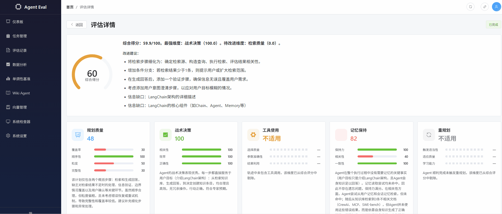
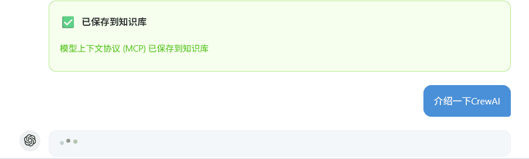

# Agent Runtime Evaluation Platform

<div align="center">


</div>

**AI Agent 运行时全维度质量评估平台。** 不仅评估最终回答质量，更评估 Agent 在执行过程中的决策质量。从规划、战术决策、工具使用、记忆保持、重规划到 RAG 检索，对 Agent 的运行轨迹进行多维量化分析。基于 LangGraph 编排、LLM-as-Judge 评分、FastAPI + Vue 3 全栈交付。

---

## 快速开始

```bash
# 1. 安装依赖
pip install -e ".[dev]"
cd frontend && npm install && cd ..

# 2. 配置 API Key（编辑 .env，填入 DEEPSEEK_API_KEY）

# 3. 启动后端
python -m app.main

# 4. 另一个终端启动前端
cd frontend && npm run dev
```

访问 http://localhost:3000 查看仪表盘，http://localhost:8000/docs 查看 API 文档。

---

## 功能演示

### 评估流程



6 维度并行评估，实时推送进度。[更多评估截图 →](docs/screenshots/evaluation.md)

### Wiki Agent — HITL 知识管理



AI 决定修改知识库时暂停等待用户确认。[更多 Wiki Agent 截图 →](docs/screenshots/wiki-agent.md)

### 系统管理


系统检查器：Sessions、Messages、Checkpoints、BM25、Vectors 等运行状态。[更多系统截图 →](docs/screenshots/system.md)

---

## 核心指标

| 指标 | 数值 |
|------|------|
| 评估维度 × 子指标 | 6 × 3~4 = 20 项 |
| 轨迹动作类型 | 14 种（Pydantic Schema 约束） |
| SDK 接入模式 | 3 种（Instrument / Proxy / Callback） |
| 单次全评估耗时 | 15~30s（6 评估器 asyncio.gather 并行） |
| 检索基准（Wiki Agent） | Top-1: **75%**, MRR: **0.825** |
| 综合分单调递减验证 | **93.1 → 20.0** |

---

## 评估体系

| 维度 | 权重 | 子指标 | 评估器 |
|------|------|--------|--------|
| 规划质量（Planning） | 20% | 覆盖率、顺序性、粒度、完整性 | `planning_evaluator.py` |
| 战术决策（Tactical） | 20% | 相关性、效率、正确性 | `tactical_evaluator.py` |
| 工具使用（Tool Use） | 15% | 选择质量、参数准确性、结果利用 | `tool_use_evaluator.py` |
| 记忆保持（Memory） | 15% | 保持力、相关性、一致性 | `memory_evaluator.py` |
| 重规划（Replan） | 15% | 触发适当性、适应质量、学习能力 | `replan_evaluator.py` |
| 检索质量（Retrieval） | 15% | 相关性、证据准确性、覆盖度 + 幻觉检测 | `retrieval_evaluator.py` |

- 质量等级：优秀 ≥ 80 · 良好 ≥ 60 · 一般 ≥ 40 · 较差 < 40
- 维度不适用时自动标记并从加权总分中剔除（权重重新归一化）

---

## 系统架构

```
┌─────────────┐     ┌───────────────────┐     ┌──────────────────┐
│   Frontend  │────▶│   FastAPI Server   │◀────│   SDK Collector  │
│  (Vue 3 +   │◀────│  (Async 全链路)    │     │  (Pydantic Schema)│
│   ECharts)  │     │                   │     └──────────────────┘
└─────────────┘     ├───────────────────┤
                    │   Evaluators × 6  │
                    │   (LLM-as-Judge)  │
                    ├───────────────────┤     ┌──────────────────┐
                    │   Redis Cache     │     │   SQLite / PG    │
                    │   (可选，优雅降级) │     │   (任务/轨迹/评估)│
                    └───────────────────┘     └──────────────────┘
```

| 子系统 | 说明 |
|--------|------|
| **评估引擎** | 6 个并行 LLM-as-Judge 评估器 + 多模型共识 + 4 阶段轨迹压缩 |
| **Wiki Agent** | RAG 知识库问答（四级混合检索 + Query 改写 + 双层记忆 + HITL CRUD） |

---

## 关键特性

| 特性 | 说明 |
|------|------|
| **Pydantic Schema SDK** | 14 种 ActionType 各有独立 Pydantic 模型，构造即类型安全 |
| **6 维评估体系** | 20 项子指标，含幻觉检测，适用性自动标记 |
| **多模型共识** | DeepSeek / GLM-4 / Qwen-Plus 独立评分，跨模型一致性量化 |
| **4 阶段轨迹压缩** | 重要性过滤 → Think 截断 → 滑动窗口 → 格式化 |
| **SSE 流式评估** | 实时推送评估进度，支持批量 / 增量 / 回归检测 |
| **增量评估** | Trajectory Diff 检测变化维度，只重算受影响项 |
| **Replay 调试器** | 回放每步 LLM 原始 Prompt / Response / Model / Latency |
| **全链路 Async** | FastAPI + SQLAlchemy + Redis 全异步 |
| **优雅降级** | Redis / Celery 不可用时自动降级，核心功能不受影响 |

---

## 技术栈

| 类别 | 技术 | 用途 |
|------|------|------|
| 后端框架 | FastAPI + Uvicorn | REST API + SSE 实时流 |
| Agent 编排 | LangGraph + LangChain | Agent 状态图、评估工作流 |
| AI 模型 | DeepSeek / GLM / Qwen / OpenAI | LLM 推理 + LLM-as-Judge |
| 向量检索 | Milvus + BM25 + RRF + Cross-Encoder | 四级混合检索 |
| 数据库 | SQLAlchemy Async + SQLite / PostgreSQL | 持久化存储 |
| 缓存 | Redis（可选） | LLM 响应缓存、限流 |
| 前端 | Vue 3 + TypeScript + Element Plus + ECharts | 管理面板与可视化 |
| SDK | Python SDK（Pydantic + httpx） | 零侵入轨迹采集 |

---

## 接入方式

```python
# LangGraph — 一行接入
from sdk import instrument_langgraph
graph = instrument_langgraph(build_graph())

# LangChain — 替换 LLM
from sdk import create_proxy_llm
llm = create_proxy_llm(ChatOpenAI(model="gpt-4"))

# 任意项目 — 手动记录
from sdk.collector import get_collector
collector = get_collector()
collector.start("任务目标", context={...})
collector.record_tool_call("search", input={...}, output=result)
collector.finish(auto_run=True)
```

---

## 项目结构

```
app/                        # 后端应用
├── evaluators/             # 6 个评估器 + 共识评估 + 轨迹压缩
├── graphs/                 # LangGraph 评估工作流
├── services/               # 业务逻辑层
├── core/                   # 基础设施（config / cache / logging）
├── api/                    # REST API + 中间件
├── wiki_agent/             # Wiki Agent（RAG / 对话 / 知识库管理）
├── models/                 # Pydantic schema 定义
└── db/                     # SQLAlchemy ORM + Alembic 迁移

frontend/                   # Vue 3 前端
sdk/                        # 独立 SDK 包
scripts/                    # 基准测试脚本
tests/                      # 测试
docs/                       # 文档
```

---

## 相关文档

| 文档 | 内容 |
|------|------|
| [Docker 部署指南](docs/deploy-docker.md) | 5 分钟快速部署、三种模式、生产配置 |
| [架构文档](docs/architecture.md) | 系统架构、组件说明、数据流 |
| [API 文档](docs/api.md) | REST 端点、SSE 事件类型 |
| [SDK 文档](sdk/README.md) | 轨迹采集 SDK API |
| [开发者指南](docs/developer_guide.md) | 本地开发、调试工具 |
| [评估截图](docs/screenshots/evaluation.md) | 评估详情页截图 |
| [Wiki Agent 截图](docs/screenshots/wiki-agent.md) | 对话、知识管理截图 |
| [系统截图](docs/screenshots/system.md) | 系统管理截图 |
