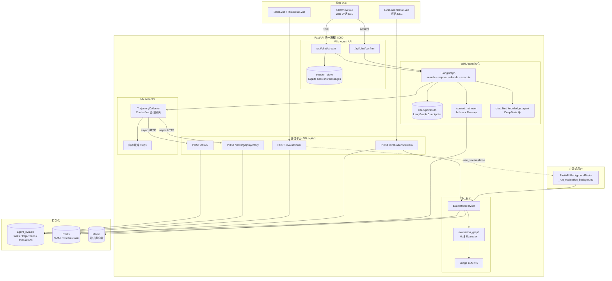
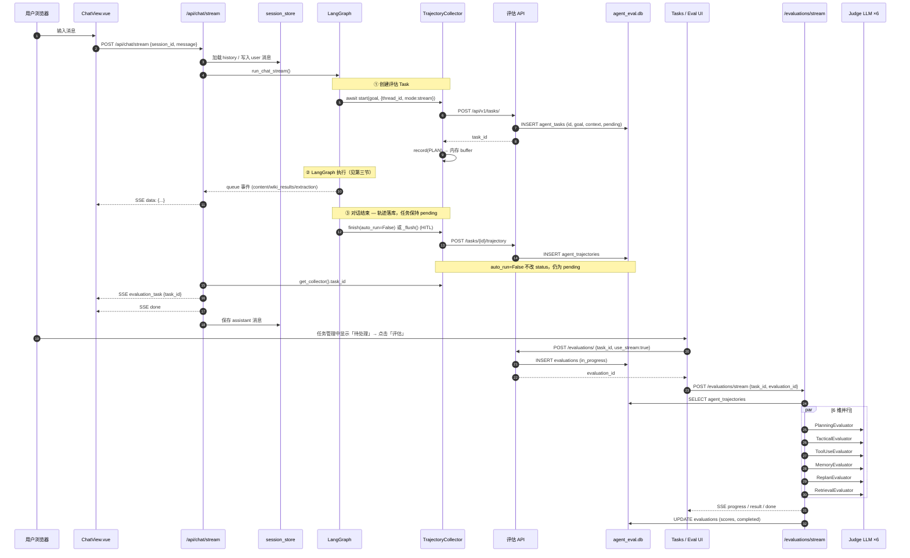
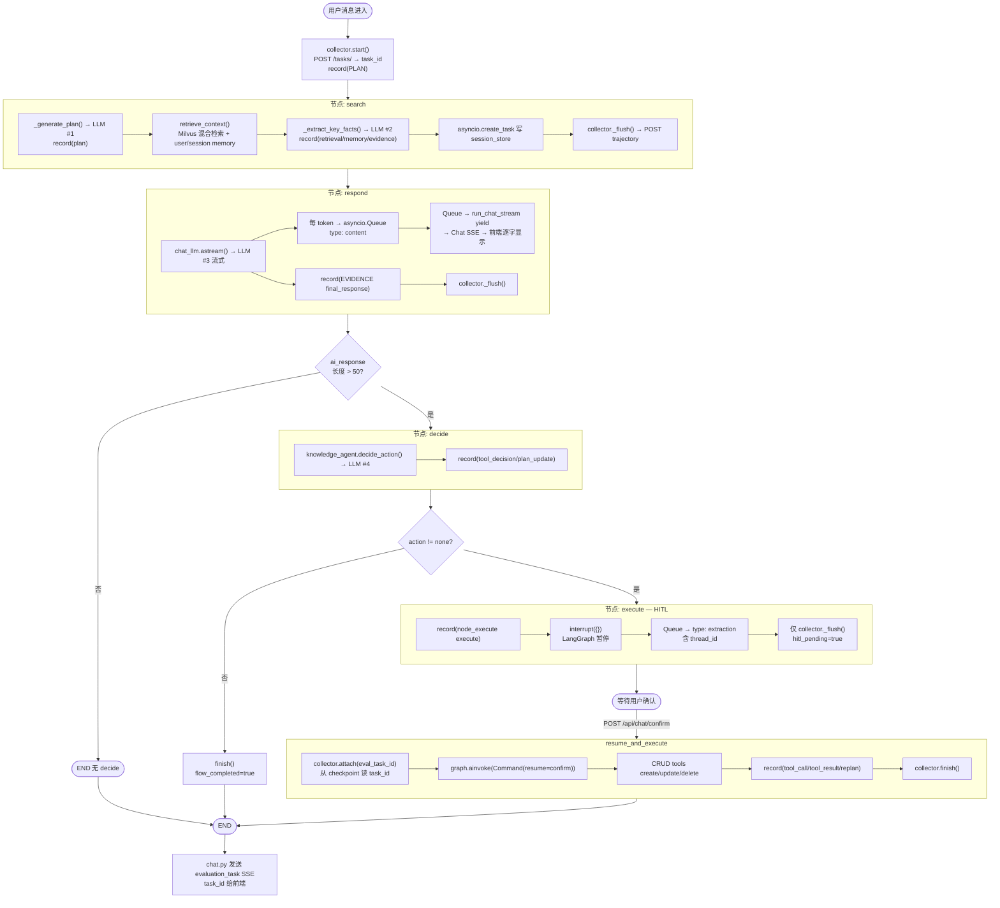
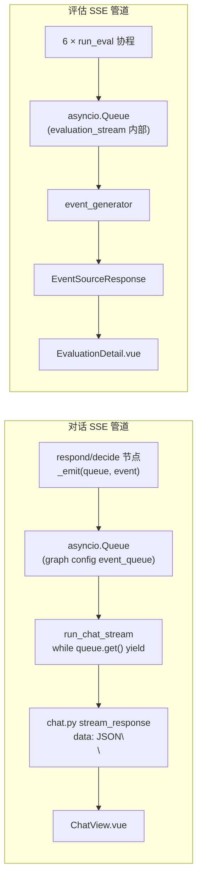
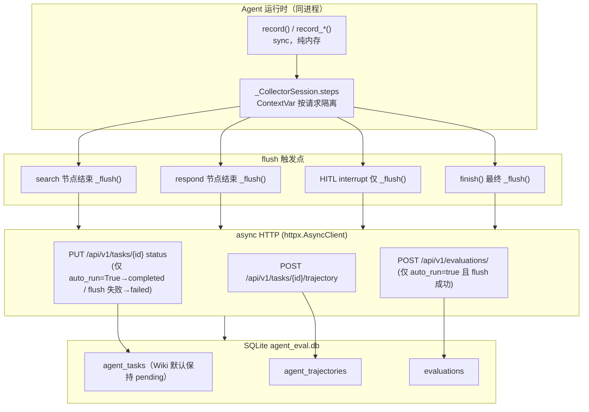
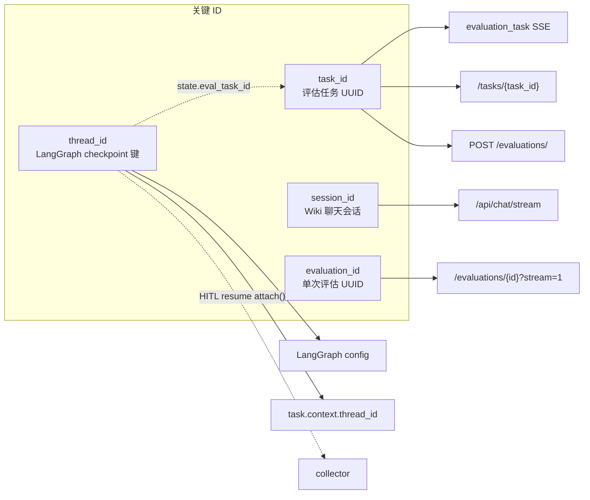
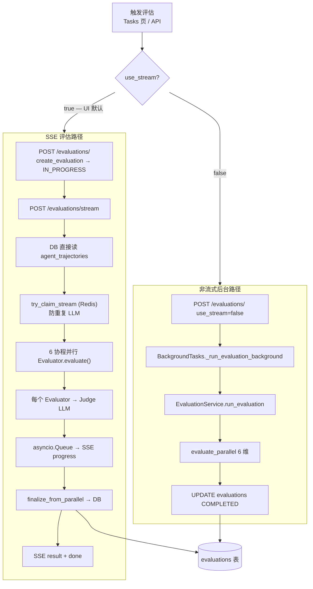
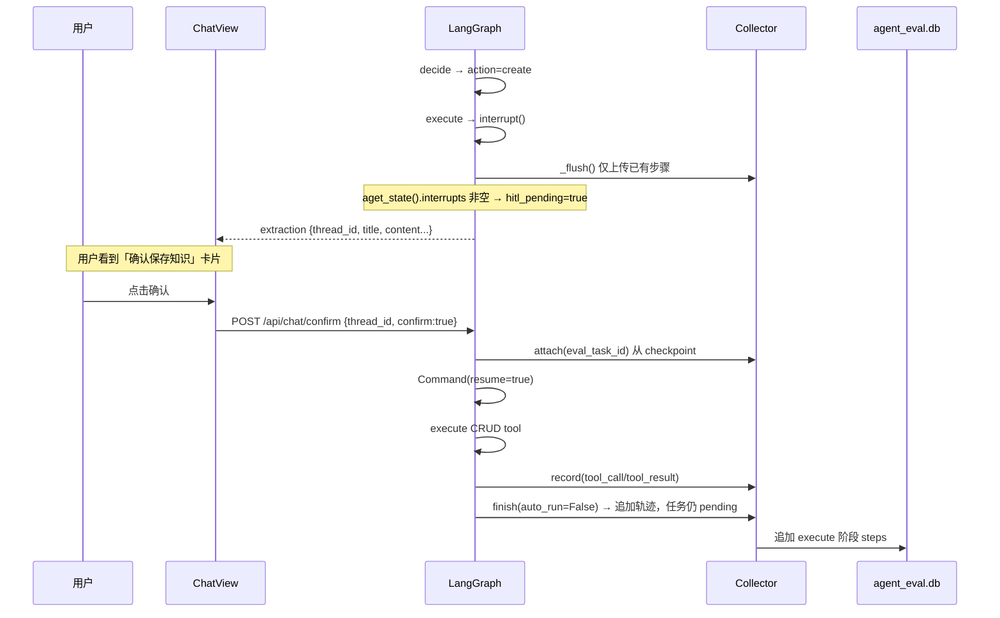
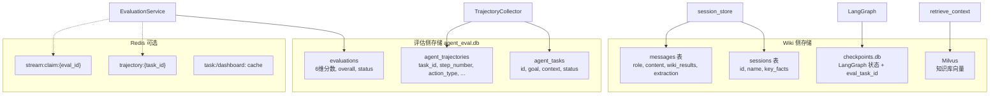

# Wiki Agent → 评估平台：完整架构与数据流

> 从 Wiki 对话、轨迹采集、LLM 调用、队列推送到评估出分的端到端数据流动说明。  
> 基于当前实现：`async collector`、`HITL interrupt` 检测、`evaluation_task` SSE 事件。

相关文档：[architecture-data-flow.md](./architecture-data-flow.md) · [two-flow-architecture.md](./two-flow-architecture.md) · [data-collection-architecture.md](./data-collection-architecture.md)

---

## 一、系统架构总览



### 组件职责速查

| 组件 | 路径 | 职责 |
|------|------|------|
| ChatView | `app/wiki_agent/frontend/src/wiki/components/ChatView.vue` | 消费对话 SSE，展示流式回复与评估链接 |
| chat router | `app/wiki_agent/routers/chat.py` | 会话管理、SSE 封装、`evaluation_task` 事件 |
| LangGraph | `app/wiki_agent/agent/graph.py` | search→respond→decide→execute 编排 |
| Collector | `sdk/collector.py` | 轨迹缓冲、HTTP 上报 task/trajectory |
| Evaluation API | `app/api/v1/endpoints/evaluation.py` | 创建评估、SSE 流式评估 |
| EvaluationService | `app/services/evaluation_service.py` | 读轨迹、跑 6 维评估、持久化分数 |

---

## 二、端到端数据流（主路径）

**典型路径**：Wiki 流式对话 → 获取 `task_id` → 用户在 Tasks 页手动评估 → SSE 实时出分。



---

## 三、LangGraph 节点级数据流



### 各节点 LLM 调用一览

| 节点 | LLM 调用 | 轨迹 record 类型 |
|------|----------|------------------|
| search | `_generate_plan`、`_extract_key_facts` | plan, retrieval, memory_read/write, evidence, node_execute, state_change |
| respond | `chat_llm.astream` | evidence(final_response), node_execute, state_change |
| decide | `knowledge_agent.decide_action` | tool_decision, plan_update, node_execute |
| execute | 无（CRUD 工具） | tool_call, tool_result, replan, failure |

### LangGraph 拓扑

```
search → respond → should_decide? → decide → should_execute? → execute → END
                      ↓ end                              ↓ end
                     END                                 END
```

---

## 四、双队列机制（对话 SSE vs 评估 SSE）

系统中有两条独立的 **asyncio.Queue + SSE** 管道，互不干扰。



| 队列 | 生产者 | 消费者 | SSE 端点 | 事件类型 |
|------|--------|--------|----------|----------|
| `event_queue` | respond / decide 节点 | `run_chat_stream` | `POST /api/chat/stream` | `content`, `wiki_results`, `status`, `extraction`, `evaluation_task`, `done`, `error` |
| eval `queue` | 6 个 Evaluator 协程 | `evaluation_stream` | `POST /api/v1/evaluations/stream` | `progress`, `result`, `error`, `done` |

### 对话 SSE 事件格式示例

```json
{"type": "content", "text": "JWT 是..."}
{"type": "wiki_results", "results": "- 向量索引 (wiki/...): ..."}
{"type": "extraction", "data": {"action": "create", "title": "...", "thread_id": "..."}}
{"type": "evaluation_task", "task_id": "550e8400-e29b-41d4-a716-446655440000"}
{"type": "done"}
```

---

## 五、TrajectoryCollector 数据流



### 单步 trajectory 结构

```json
{
  "step_number": 3,
  "action_type": "retrieval",
  "action_detail": {
    "query": "JWT 认证原理",
    "retrieved_docs": [{"title": "...", "path": "...", "snippet": "..."}]
  },
  "observation": null,
  "timestamp": "2026-07-13T12:00:00+00:00"
}
```

### Collector API 分层

| 类型 | 方法 | 说明 |
|------|------|------|
| async（含网络 I/O） | `start()`, `finish()`, `_flush()` | 须在 async 函数中 `await` |
| sync（纯内存） | `record()`, `record_*()`, `attach()` | LangGraph 节点 / LangChain 回调内直接调用 |

---

## 六、ID 流转



| ID | 生成位置 | 用途 |
|----|----------|------|
| `session_id` | 前端 / 默认 `"default"` | Wiki 多轮对话、消息历史（`session_store`） |
| `thread_id` | `run_chat_stream` 内 `uuid4()` | LangGraph checkpoint；写入 `task.context` |
| `task_id` | `collector.start()` → `POST /tasks/` | 轨迹容器；评估输入；前端评估链接 |
| `evaluation_id` | `POST /evaluations/` | 单次评估记录；SSE stream 参数 |

---

## 七、评估阶段详细数据流



### Evaluator 输入 / 输出

**输入：**

- `goal` ← `agent_tasks.goal`
- `trajectory` ← `agent_trajectories[]`（按 `step_number` 排序）
- `context` ← `agent_tasks.context`

**输出（写入 `evaluations`）：**

- `planning_score` / `planning_feedback`
- `tactical_score` / `tactical_feedback`
- `tool_use_score` / `tool_use_feedback`
- `memory_score` / `memory_feedback`
- `replan_score` / `replan_feedback`
- `retrieval_score` / `retrieval_feedback`
- `overall_score`
- `status = completed`

### 评估 SSE 事件示例

```
event: progress
data: {"dimension":"planning","score":78.0,"progress":1,"total":6}

event: result
data: {"scores":{"planning":78,...},"overall":72.5,"evaluation_id":"..."}

event: done
data: {}
```

---

## 八、HITL 分支时序（知识库 CRUD 确认）



**要点：**

- interrupt 时 **不** 调用 `finish()`，只 `_flush()`，避免在 HITL 未结束时结束会话。
- 对话/resume 正常结束调用 `finish(auto_run=False)`：只 flush 轨迹，**不**标 completed、**不**自动评估；任务管理显示「待处理」。
- `search` 节点将 `eval_task_id` 写入 state，供 `resume_and_execute` 中 `collector.attach()` 复用同一 task。
- `attach()` **不** 重置 `eval_triggered`，避免重复触发评估。

---

## 九、存储层一览



| 存储 | 文件 / 服务 | 生命周期 |
|------|-------------|----------|
| Wiki 会话 | `app/wiki_agent/data/` SQLite | 用户聊天历史、key_facts |
| LangGraph Checkpoint | `checkpoints.db` | HITL 暂停 / resume |
| 评估 Task | `agent_eval.db` → `agent_tasks` | 一次 Agent 运行 |
| 轨迹 Steps | `agent_eval.db` → `agent_trajectories` | 随 task 持久化 |
| 评估结果 | `agent_eval.db` → `evaluations` | 每次评估一条记录 |
| 向量库 | Milvus | 知识库检索 |

---

## 十、关键设计要点

1. **Wiki 对话默认不 auto_run 评估**：`finish(auto_run=False)` 只上报轨迹，任务保持 `pending`；用户在 Tasks 页手动点「评估」。
2. **轨迹先于评估**：评估从 DB 读 `agent_trajectories`；空轨迹会导致全 0 分。`auto_run=True` 时仅在 `flush_succeeded` 后触发。
3. **同进程 HTTP 上报**：Collector 通过 `EVAL_API_BASE_URL`（默认 `http://127.0.0.1:8000`）调用自身 FastAPI。
4. **ContextVar 会话隔离**：并发 Wiki 对话共享 Collector 单例，但各自独立 `task_id` / buffer。
5. **两条 SSE 独立**：对话流（token 级）与评估流（维度级）使用不同 Queue 与端点。
6. **中途 flush**：search / respond 节点结束后 `_flush()`，降低长对话轨迹丢失风险。
7. **非流式评估**：`use_stream=false` 时用 FastAPI `BackgroundTasks`，已移除 Celery。

---

## 十一、代码入口索引

| 阶段 | 文件 | 函数 / 端点 |
|------|------|-------------|
| 前端发消息 | `app/wiki_agent/frontend/.../ChatView.vue` | `sendMessage()` → `POST /api/chat/stream` |
| 对话 SSE | `app/wiki_agent/routers/chat.py` | `stream_response()` |
| 图编排 | `app/wiki_agent/agent/graph.py` | `run_chat_stream()`, `resume_and_execute()` |
| 创建 task | `sdk/collector.py` | `await start()` → `POST /api/v1/tasks/` |
| 上报轨迹 | `sdk/collector.py` | `await _flush()` → `POST /api/v1/tasks/{id}/trajectory` |
| 创建评估 | `app/api/v1/endpoints/evaluation.py` | `POST /evaluations/` |
| 流式评估 | `app/api/v1/endpoints/evaluation.py` | `POST /evaluations/stream` |
| 持久化轨迹 | `app/services/evaluation_service.py` | `add_trajectory()` |
| 跑评估 | `app/services/evaluation_service.py` | `run_evaluation()` / `finalize_from_parallel()` |

---

## 十二、诊断日志

启用后可在日志中追踪完整链路（前缀 `[EvalDiag]`）：

```
[EvalDiag] start task_id=... remote task created
[EvalDiag] _flush POST task_id=... steps=N
[EvalDiag] trajectory persisted task_id=... added=N total=M
[EvalDiag] finish after flush steps_remaining=0
[EvalDiag] SSE /evaluations/stream trajectory_steps=M
[EvalDiag] evaluator dim=planning llm_calls=1 elapsed_ms=3000+
```

若出现 `trajectory_steps=0` 或 `BUG PATH: auto_run triggered AFTER flush failure`，说明轨迹未入库或 flush 失败，需检查 `EVAL_API_BASE_URL` 与网络连通性。
